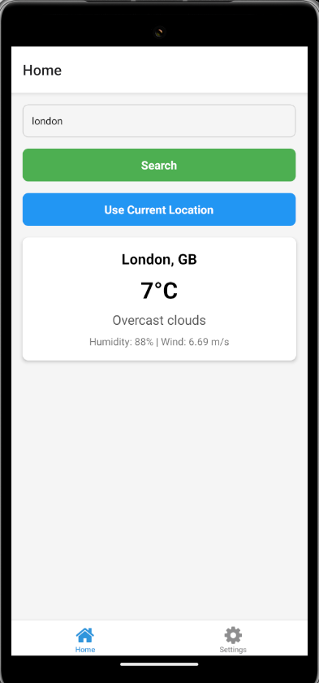
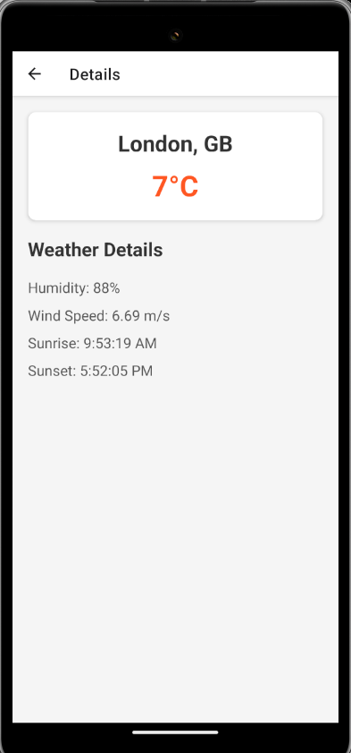
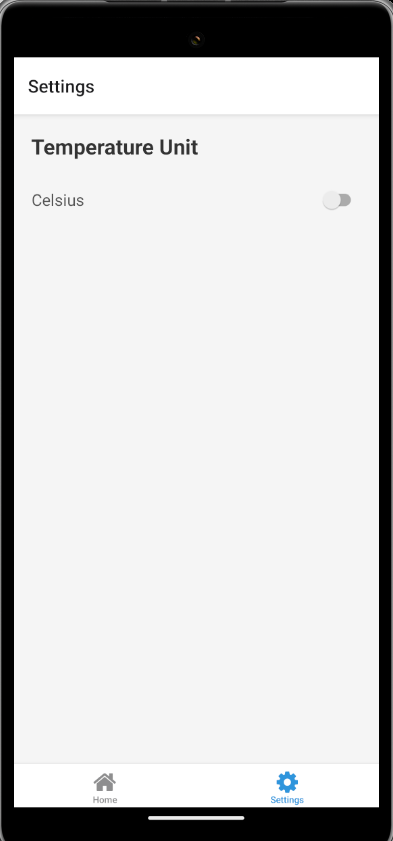

# Weather App

This is a simple weather application that fetches weather data using APIs and displays it based on either city name or geolocation.

## Getting Started

Follow these steps to get the project up and running on your local machine:

1. Clone the repository:
```bash
   git clone git@github.com:serkrush/weather.git
```
2. Navigate to the project directory:
```bash
    cd weather/
```
3. Install the necessary dependencies:
```bash
    npm i
```
4. Connect your device (make sure your development device is ready).
5. Start the project:
```bash
    npx expo start
```
6. Press "a" to open the app on an Android device or emulator.

## APIs Used
1. OpenWeatherMap API - https://api.openweathermap.org
    - Used to search for weather data by city name or geolocation.
2. GeoDB Cities API - https://wft-geo-db.p.rapidapi.com
    - Used to search for cities by name.

## API_KEY
Make sure to add your API keys in the config.js file for both APIs.
```bash
// config.js
export const OPENWEATHERMAP_API_KEY = 'your_openweathermap_api_key';
export const WTFGEODB_API_KEY = 'your_geodb_api_key';
```

## Android Screenshot



